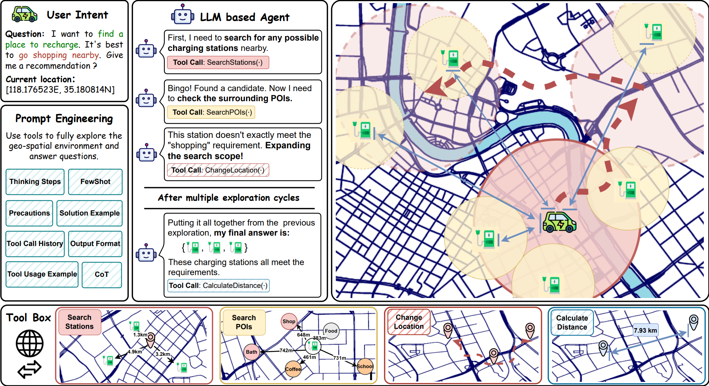

# EVGeoQA: Benchmarking LLMs on Dynamic, Multi-Objective Geo-Spatial Exploration

## Introduction

**EVGeoQA** is a novel **Geo-Spatial Question Answering (GSQA) benchmark** designed to evaluate the **purpose-driven exploration capabilities** of Large Language Models (LLMs) within dynamic environments.

While existing GSQA benchmarks predominantly focus on static retrieval tasks, real-world spatial planning is often complex and multi-objective. EVGeoQA bridges this gap by introducing a distinct **location-anchored** and **dual-objective** design built upon the Electric Vehicle (EV) charging scenario.
<div align=center>    
</div>

### Key Features:
- **Dynamic User Locations:** Unlike random sampling, user coordinates are synthesized using K-Means clustering on population heatmaps to simulate realistic starting points.
- **Dual-Objective Constraints:** Each query requires the agent to find a target that satisfies two simultaneous demands:
    1.  **Charging Necessity:** Finding an available charging station.
    2.  **Co-located Activity:** Ensuring the station is within walking distance of a specific Point of Interest (POI) .
- **Long-Range Exploration:** The dataset spans varying distances, challenging LLMs to perform multi-step reasoning rather than simple local retrieval.

## Dataset Statistics

The dataset covers three representative Chinese cities—Hangzhou (Provincial Capital), Qingdao (Regional Economic Hub), and Linyi (Prefecture-level City)—providing a hierarchical gradient of urban complexity.

| City | Charging Stations | User Locations | POI Categories | Total QA Pairs |
| :--- | :--: | :--: | :--: | :--: |
| **Hangzhou** | 260 | 997 | 25 | 24,925 |
| **Qingdao** | 180 | 995 | 23 | 22,885 |
| **Linyi** | 185 | 997 | 21 | 20,890 |

*Data Source: State Grid Corporation of China & Amap API.* 

## Dataset Examples

Below is a sample entry from the **EVGeoQA** dataset. Each entry represents a unique query anchored to a specific user location, containing the natural language question, metadata, and a list of ground truth answers.

```json
{
    "Question_id": 1, 
    "Question": "我想找一个充电桩，充好电后去吃顿好的，你能帮我推荐一个吗？", 
    "Question_location": "浙江省嘉兴市桐乡市洲泉镇", 
    "Question_location_coord": [30.573871636176943, 120.37401098079212], 
    "Question_type": "advance", 
    "Question_poi": "中餐厅;中餐厅 ", 
    "Answer": [
        {
            "Station_id": "B0FFLC00X0", 
            "Station_name": "国家电网浙江省杭州市临平区世纪公园充电站", 
            "Station_coord": [30.440093, 120.304083], 
            "Distance": 16.27918236259536, 
            "Station_poi_type": "餐饮服务;中餐厅;特色/地方风味餐厅", 
            "Station_poi_name": "沙县小吃(都市港湾店)", 
            "correlation_measure": 0.9270795087435726
        }, 
        {
            "Station_id": "B0FFLC02UF", 
            "Station_name": "国家电网浙江省杭州市临平区塘栖芦塘里公共充电站", 
            "Station_coord": [30.461952, 120.203856], 
            "Distance": 20.510277527983952, ""
            "Station_poi_type": "餐饮服务;中餐厅;中餐厅", 
            "Station_poi_name": "芦塘湾庭院餐厅", 
            "correlation_measure": 0.9501898007499954
        },
        {
            "Station_id": "B0HKFO26I5", 
            "Station_name": "国家电网浙江省杭州市临平区乐盈天充电站", 
            "Station_coord": [30.479174, 120.186197], 
            "Distance": 20.859448296179416, 
            "Station_poi_type": "餐饮服务;中餐厅;浙江菜",
            "Station_poi_name": "乐盈天酒店(西石塘街店)", 
            "correlation_measure": 0.8955389568369476
        }, 
        {
            "Station_id": "B0GK35UC20", 
            "Station_name": "国家电网浙江省杭州市临平区塘栖塘康交流公共充电站", 
            "Station_coord": [30.446552, 120.161504], 
            "Distance": 24.80560410247837, 
            "Station_poi_type": "餐饮服务;中餐厅;安徽菜(徽菜)", 
            "Station_poi_name": "安徽饭店", 
            "correlation_measure": 0.8990619172182166
        }, 
        {
            "Station_id": "B0G17DW09K", 
            "Station_name": "国家电网浙江省杭州市临平区乔司街道办事处充电站", 
            "Station_coord": [30.348815, 120.287265], 
            "Distance": 26.303926763061174, 
            "Station_poi_type": "餐饮服务;中餐厅;火锅店", 
            "Station_poi_name": "叶记潮汕牛肉火锅(乔司店)", 
            "correlation_measure": 0.911545218882879
        }
    ]
}

```

---

* **`Question_id`**: A unique integer identifier for the data sample.
  
* **`Question`**: The natural language query reflecting the dual-objective demand (charging + activity).
  
* **`Question_location`**: Textual description of the user's current administrative address.
  
* **`Question_location_coord`**: The specific `[Latitude, Longitude]` coordinates of the user.
  
* **`Question_type`**: Indicates the complexity of the query.
  
* **`Question_poi`**: The ground truth POI category slot derived from the user's intent.

---

* **`Station_id`**: Unique identifier for the charging station.

* **`Station_name`**: The official name of the recommended charging station.

* **`Station_coord`**: The `[Latitude, Longitude]` coordinates of the station.

* **`Distance`**: The driving distance (in km) between the user (`Question_location_coord`) and the station. 

* **`Station_poi_type`**: The specific category of the POI found nearby that satisfies the secondary activity 

* **`Station_poi_name`**: The name of the specific POI located within a 1km walkable radius of the station.

* **`correlation_measure`**: The cosine similarity score between the query's intent and the station's POI, calculated using the CONAN embedding model.

---


## Dataset Availability

⚠️ **Note:** This work is currently under review. The complete dataset and the associated code repository will be made publicly available upon acceptance of the paper.

---

## GeoRover Framework: Tool-Augmented Geo-Spatial Agent

<div align=center>    
</div>
To rigorously evaluate LLMs, we develop a Tool-Augmented Geo-Spatial Agent Framework, GeoRover. This framework restricts the agent to partial observability, compelling it to actively explore the environment.

The agent interacts with the environment using four atomic tools:

1. **`SearchStations`**: Retrieves charging stations within a localized 5km radius.

   input format:

   ```json
   {
        "tool_name": "Search_Stations",
        "coord": [118.292622, 35.189944]
   }   
   ```

   output format: 

   ```json
   [   {   'address': '枣园镇枣园小镇西门北50米',     
           'coord': '118.292746,35.189921',
           'station_distance': '9 meters',
           'station_name': '国家电网汽车充电站(山东省临沂市兰山区枣园镇)',
           'tag': [],
           'type': '汽车服务;充电站;充电站'},
       {   'address': '枣园镇枣园小镇西门北50米',
           'coord': '118.292746,35.189921',
           'station_distance': '9 meters',
           'station_name': '国家电网汽车充电站(山东省临沂市兰山区枣园镇)',
           'tag': [],
           'type': '汽车服务;充电站;充电站'},
       }   
   ]
   ```

2. **`SearchPOIs`**: Inspects POIs within a walkable 1km radius of a specific station to verify the secondary activity constraint.
   input format:

   ```json
   {
       "tool_name": "Search_Nearby_POI",
       "coord": [118.292622, 35.189944]
   }
   ```

   output format: 

   ```json
   [   {   'address': '枣园镇枣园小镇西门南三户',
           'poi_distance': '30 meters',
           'poi_name': '康乐中医推拿院(枣园小镇店)',
           'tag': [],
           'type': '生活服务;洗浴推拿场所;洗浴推拿场所'},
       {   'address': '枣园镇枣园小镇西门沿街1号',
           'poi_distance': '31 meters',
           'poi_name': '慧欣美容养生会所(枣园小镇店)',
           'tag': [],
           'type': '生活服务;美容美发店;美容美发店'},
       {   'address': '枣园小镇西门南6号',
           'poi_distance': '34 meters',
           'poi_name': 'UCC干洗(枣园小镇店)',
           'tag': [],
           'type': '生活服务;洗衣店;洗衣店'
       },  
   ]
   ```
3. **`ChangeLocation`**: The core exploration mechanism. It allows the agent to shift its coordinates (North, South, East, West) to expand its search scope when local solutions are insufficient.
   input format:

   ```json
   {
       "tool_name": "Change_Current_Location",
       "start_location": [118.292622, 35.189944],
       "distance": "500",
       "direction": "N"
   }
   ```

   output format: 
   
   ```json
   {
       "new_location": [118.292622, 35.189944]
   }
   ```
4. **`CalculateDistance`**: Computes accurate navigation distances to optimize travel costs.
   input format:

   ```json
   {
       "tool_name": "Cal_Distance",
       "coord1": [118.292622, 35.189944]
       "coord2": [118.292322, 35.187944]
   } 
   ```
   output format: 

   ```json
   {
    	"distance": "42.1 meters"
   }
   ```


## Prompt & Code

We provide the key prompts used in our pipeline to ensure reproducibility.

Prompts for different stages can be found in the `/prompts` folder.

Furthermore, the complete source code for our framework will be made publicly available upon the acceptance of the paper.

## Future Plans

We are committed to advancing the field of Embodied Spatial Intelligence. Our roadmap includes:

- **Multilingual Support:** We plan to release an **English version** of the EVMapQA dataset to facilitate global research.
- **Domain Expansion:** We aim to extend the data generation pipeline to cover broader geo-spatial exploration domains beyond EV charging, incorporating more diverse urban topologies and complex constraint types.
- **Model Optimization:** Investigating domain-specific fine-tuning (SFT) to improve LLM performance on long-horizon spatial planning tasks.
